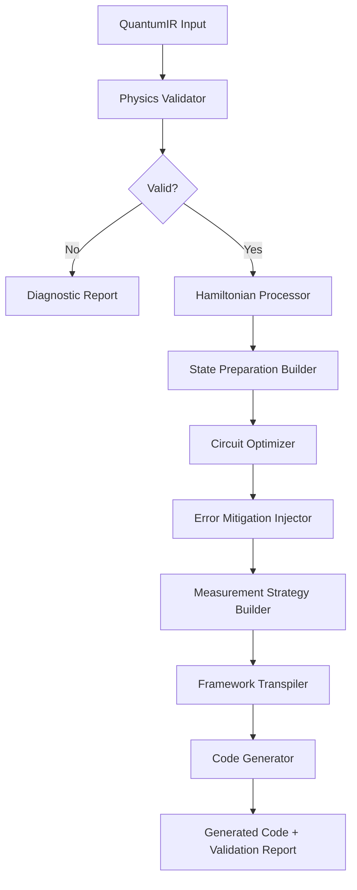

# Design Document: Revolutionary Quantum Code Generator

## Overview

This design enhances the `@quantum-dev/code-generator` package to transform it into an expert-level code generation system. This package is a component of the larger Quantum Dev VS Code extension and focuses specifically on translating physics-first quantum representations (QuantumIR) into production-ready, executable code for Qiskit, Cirq, and PennyLane frameworks.

**Package Scope**: This package handles ONLY the code generation layer - it receives QuantumIR from the physics-core package and generates framework-specific Python code with advanced features like error mitigation, optimization, and physics validation.

### Core Design Principles

1. **Physics-First Code Generation**: Generated code preserves and validates physics principles from QuantumIR
2. **Framework-Agnostic IR**: QuantumIR remains independent; generators handle framework specifics
3. **Production-Ready Output**: Generated code includes error handling, validation, and optimization
4. **Expert-Level Features**: Advanced techniques like error mitigation, noise modeling, and sophisticated algorithms
5. **Extensible Architecture**: Easy to add new frameworks or code generation strategies

## Architecture

### Package Architecture (Code Generation Layer Only)

```
┌─────────────────────────────────────────────────────────────┐
│                  QuantumIR (Input from physics-core)         │
│  Contains: gates, measurements, physics metadata,            │
│  Hamiltonian, symmetries, algorithm type                     │
└─────────────────────────────────────────────────────────────┘
                            │
                            ▼
┌─────────────────────────────────────────────────────────────┐
│              Code Generation Orchestrator                    │
│  - Analyzes QuantumIR                                        │
│  - Selects appropriate code generation strategies            │
│  - Coordinates framework-specific generators                 │
└─────────────────────────────────────────────────────────────┘
                            │
                ┌───────────┴───────────┐
                ▼                       ▼
┌──────────────────────┐    ┌──────────────────────┐
│  Code Enhancement    │    │  Validation Code     │
│  Modules             │    │  Generator           │
│  - Error Mitigation  │    │  - Physics checks    │
│  - Noise Modeling    │    │  - Symmetry tests    │
│  - Optimization      │    │  - Diagnostics       │
└──────────────────────┘    └──────────────────────┘
                │                       │
                └───────────┬───────────┘
                            ▼
┌─────────────────────────────────────────────────────────────┐
│         Framework-Specific Code Generators                   │
│  ┌──────────────┬────────────────┬────────────────────────┐ │
│  │ Qiskit       │ Cirq           │ PennyLane             │ │
│  │ Generator    │ Generator      │ Generator             │ │
│  │ (Enhanced)   │ (Enhanced)     │ (Enhanced)            │ │
│  └──────────────┴────────────────┴────────────────────────┘ │
└─────────────────────────────────────────────────────────────┘
                            │
                            ▼
┌─────────────────────────────────────────────────────────────┐
│              Generated Python Code Output                    │
│  - Executable quantum circuits                               │
│  - Error mitigation code                                     │
│  - Validation functions                                      │
│  - Optimization loops                                        │
│  - Documentation and comments                                │
└─────────────────────────────────────────────────────────────┘
```

### Component Interaction Flow



## Components and Interfaces

### 1. Enhanced QuantumIR

**Purpose**: Extended intermediate representation with comprehensive physics metadata

**New Interfaces**:

```typescript
interface EnhancedQuantumIR extends QuantumIR {
  // Hamiltonian specification
  hamiltonian: {
    type: 'pauli_sum' | 'fermionic' | 'molecular' | 'custom';
    terms: HamiltonianTerm[];
    couplingConstants: number[];
    fermionMapping?: 'jordan_wigner' | 'bravyi_kitaev' | 'parity';
  };
  
  // Noise model
  noiseModel?: {
    gateErrors: Map<GateType, NoiseChannel[]>;
    t1Times: number[];  // per qubit
    t2Times: number[];  // per qubit
    readoutErrors: number[][];  // confusion matrix
    crosstalk: CrosstalkModel;
  };
  
  // Error mitigation strategy
  errorMitigation?: {
    techniques: ('zne' | 'pec' | 'dd' | 'rem')[];
    zneScalingFactors?: number[];
    ddSequence?: 'xy4' | 'cpmg' | 'ur';
    pecSamplingOverhead?: number;
  };
  
  // Optimization configuration
  optimization: {
    ansatzType?: 'hardware_efficient' | 'uccsd' | 'qaoa' | 'custom';
    optimizer: OptimizerConfig;
    initializationStrategy: 'random' | 'identity' | 'physics_informed';
    gradientMethod?: 'parameter_shift' | 'finite_diff' | 'adjoint';
  };
  
  // Measurement strategy
  measurementStrategy: {
    type: 'computational' | 'pauli_grouping' | 'classical_shadows' | 'weak';
    observables: Observable[];
    shotAllocation?: 'uniform' | 'variance_optimal';
    groupingStrategy?: 'commuting' | 'qubit_wise';
  };
  
  // Validation constraints
  validationConstraints: {
    maxCircuitDepth?: number;
    maxTwoQubitGates?: number;
    requiredFidelity?: number;
    symmetryTolerance: number;
  };
}

interface HamiltonianTerm {
  coefficient: number | Complex;
  operators: PauliOperator[];
  qubits: number[];
}

interface NoiseChannel {
  type: 'depolarizing' | 'amplitude_damping' | 'phase_damping' | 'thermal';
  parameters: number[];
}

interface CrosstalkModel {
  adjacencyMatrix: number[][];
  crosstalkCoefficients: number[][];
}

interface OptimizerConfig {
  name: 'cobyla' | 'lbfgsb' | 'spsa' | 'adam' | 'natural_gradient';
  maxIterations: number;
  tolerance: number;
  learningRate?: number;
  adaptiveStrategy?: boolean;
}
```

### 2. Physics Validation Engine

**Purpose**: Validate quantum circuits against fundamental physics principles

**Key Classes**:

```typescript
class PhysicsValidator {
  validateSymmetries(ir: EnhancedQuantumIR): ValidationResult;
  validateConservation(ir: EnhancedQuantumIR): ValidationResult;
  validateUnitarity(gates: QuantumGate[]): ValidationResult;
  computeEntanglementEntropy(state: QuantumState, partition: number[]): number;
  verifyEnergySpectrum(ir: EnhancedQuantumIR): ValidationResult;
}

class SymmetryValidator {
  // Check if gates preserve specified symmetries
  checkSymmetryPreservation(
    gates: QuantumGate[],
    symmetry: Symmetry,
    tolerance: number
  ): boolean;
  
  // Compute symmetry eigenvalues
  computeSymmetryEigenvalues(
    circuit: QuantumCircuit,
    symmetryOperator: Operator
  ): number[];
}

class ConservationChecker {
  // Verify conservation laws
  checkConservation(
    gates: QuantumGate[],
    conservedQuantity: Observable
  ): boolean;
  
  // Compute commutators
  computeCommutator(
    operator1: Operator,
    operator2: Operator
  ): Operator;
}

interface ValidationResult {
  isValid: boolean;
  violations: Violation[];
  diagnostics: PhysicsDiagnostics;
  recommendations: string[];
}

interface Violation {
  type: 'symmetry' | 'conservation' | 'unitarity' | 'energy';
  severity: 'error' | 'warning';
  description: string;
  affectedGates: number[];
  suggestedFix?: string;
}

interface PhysicsDiagnostics {
  entanglementEntropy: number[];
  circuitDepth: number;
  twoQubitGateCount: number;
  estimatedFidelity: number;
  symmetryEigenvalues?: number[];
}
```

### 3. Hamiltonian Processor

**Purpose**: Handle Hamiltonian decomposition and time evolution

**Key Classes**:

```typescript
class HamiltonianProcessor {
  // Decompose Hamiltonian into Pauli terms
  decomposeToPauliSum(hamiltonian: Hamiltonian): PauliSum;
  
  // Apply fermion-to-qubit mapping
  applyFermionMapping(
    fermionic: FermionicOperator,
    mapping: 'jordan_wigner' | 'bravyi_kitaev'
  ): PauliSum;
  
  // Generate Trotter evolution circuit
  generateTrotterCircuit(
    hamiltonian: PauliSum,
    time: number,
    steps: number,
    order: 1 | 2 | 4
  ): QuantumGate[];
  
  // Estimate Trotter error
  estimateTrotterError(
    hamiltonian: PauliSum,
    time: number,
    steps: number,
    order: number
  ): number;
}

class TrotterDecomposer {
  // First-order Trotter
  firstOrderTrotter(terms: HamiltonianTerm[], dt: number): QuantumGate[];
  
  // Second-order Suzuki
  secondOrderSuzuki(terms: HamiltonianTerm[], dt: number): QuantumGate[];
  
  // Fourth-order Suzuki
  fourthOrderSuzuki(terms: HamiltonianTerm[], dt: number): QuantumGate[];
  
  // Adaptive time stepping
  adaptiveTimeStep(
    hamiltonian: PauliSum,
    targetError: number
  ): number[];
}

class FermionMapper {
  jordanWigner(operator: FermionicOperator): PauliSum;
  bravyiKitaev(operator: FermionicOperator): PauliSum;
  parity(operator: FermionicOperator): PauliSum;
}
```

### 4. State Preparation Builder

**Purpose**: Generate circuits for complex initial state preparation

**Key Classes**:

```typescript
class StatePreparer {
  // Arbitrary state preparation
  prepareArbitraryState(
    amplitudes: Complex[],
    method: 'shende_bullock' | 'variational' | 'amplitude_encoding'
  ): QuantumGate[];
  
  // Thermal state preparation
  prepareThermalState(
    hamiltonian: Hamiltonian,
    temperature: number,
    method: 'imaginary_time' | 'gibbs_sampling'
  ): QuantumGate[];
  
  // Entangled state preparation
  prepareEntangledState(
    stateType: 'bell' | 'ghz' | 'w' | 'custom',
    numQubits: number
  ): QuantumGate[];
}

class ShendeBullockMarkovDecomposer {
  // Exact state synthesis with optimal depth
  decompose(targetState: Complex[]): QuantumGate[];
  
  // Compute required gate count
  estimateGateCount(numQubits: number): number;
}

class VariationalStatePreparer {
  // Prepare state using variational optimization
  prepareState(
    targetState: Complex[],
    fidelityTarget: number
  ): { gates: QuantumGate[], parameters: number[] };
}
```

### 5. Error Mitigation Injector

**Purpose**: Inject error mitigation techniques into generated circuits

**Key Classes**:

```typescript
class ErrorMitigationInjector {
  // Apply zero-noise extrapolation
  applyZNE(
    circuit: QuantumGate[],
    scalingFactors: number[]
  ): { circuits: QuantumGate[][], extrapolationFunc: Function };
  
  // Insert dynamical decoupling
  applyDynamicalDecoupling(
    circuit: QuantumGate[],
    sequence: 'xy4' | 'cpmg' | 'ur',
    idleThreshold: number
  ): QuantumGate[];
  
  // Generate readout error mitigation
  generateReadoutMitigation(
    numQubits: number,
    confusionMatrix: number[][]
  ): string; // Code for calibration and correction
  
  // Probabilistic error cancellation
  applyPEC(
    circuit: QuantumGate[],
    noiseModel: NoiseModel,
    samplingOverhead: number
  ): { circuits: QuantumGate[][], weights: number[] };
}

class DynamicalDecouplingSequencer {
  // XY-4 sequence
  xy4Sequence(qubit: number): QuantumGate[];
  
  // CPMG sequence
  cpmgSequence(qubit: number, pulses: number): QuantumGate[];
  
  // Universal robust sequence
  urSequence(qubit: number): QuantumGate[];
  
  // Find idle periods in circuit
  findIdlePeriods(
    circuit: QuantumGate[],
    threshold: number
  ): { qubit: number, start: number, duration: number }[];
}

class ZeroNoiseExtrapolator {
  // Generate noise-scaled circuits
  scaleNoise(
    circuit: QuantumGate[],
    scalingFactor: number
  ): QuantumGate[];
  
  // Extrapolate to zero noise
  extrapolate(
    scalingFactors: number[],
    results: number[]
  ): number;
}
```

### 6. Circuit Optimization Pipeline

**Purpose**: Optimize circuits for depth, gate count, and hardware constraints

**Key Classes**:

```typescript
class CircuitOptimizer {
  // Apply optimization passes
  optimize(
    circuit: QuantumGate[],
    passes: OptimizationPass[]
  ): QuantumGate[];
  
  // Hardware-aware transpilation
  transpile(
    circuit: QuantumGate[],
    deviceTopology: DeviceTopology,
    nativeGates: GateType[]
  ): QuantumGate[];
  
  // Minimize SWAP gates
  minimizeSwaps(
    circuit: QuantumGate[],
    topology: DeviceTopology
  ): QuantumGate[];
}

class OptimizationPass {
  // Gate cancellation
  cancelGates(circuit: QuantumGate[]): QuantumGate[];
  
  // Commutation-based optimization
  commuteGates(circuit: QuantumGate[]): QuantumGate[];
  
  // Template matching
  applyTemplates(circuit: QuantumGate[]): QuantumGate[];
  
  // Single-qubit gate optimization
  optimizeSingleQubitGates(circuit: QuantumGate[]): QuantumGate[];
}

class SwapRouter {
  // SABRE algorithm for SWAP insertion
  sabreRouting(
    circuit: QuantumGate[],
    topology: DeviceTopology
  ): QuantumGate[];
  
  // Compute routing overhead
  estimateSwapOverhead(
    circuit: QuantumGate[],
    topology: DeviceTopology
  ): number;
}

interface DeviceTopology {
  qubits: number;
  connectivity: [number, number][];
  nativeGates: GateType[];
  gateErrors: Map<string, number>;
}
```

### 7. Measurement Strategy Builder

**Purpose**: Optimize measurement strategies for observables

**Key Classes**:

```typescript
class MeasurementOptimizer {
  // Group commuting observables
  groupObservables(
    observables: Observable[],
    strategy: 'commuting' | 'qubit_wise'
  ): Observable[][];
  
  // Optimal shot allocation
  allocateShots(
    observables: Observable[],
    totalShots: number,
    variances: number[]
  ): number[];
  
  // Generate measurement circuits
  generateMeasurementCircuits(
    observableGroups: Observable[][]
  ): QuantumGate[][];
}

class ClassicalShadowsBuilder {
  // Generate randomized measurement protocol
  generateProtocol(
    numQubits: number,
    numShadows: number
  ): MeasurementProtocol[];
  
  // Reconstruct expectation values
  reconstructExpectation(
    shadows: ClassicalShadow[],
    observable: Observable
  ): { value: number, variance: number };
}

class PauliGrouper {
  // Find maximal commuting sets
  findCommutingSets(observables: PauliObservable[]): PauliObservable[][];
  
  // Compute measurement basis rotations
  computeBasisRotations(group: PauliObservable[]): QuantumGate[];
}
```

### 8. Variational Algorithm Builder

**Purpose**: Generate optimized variational quantum circuits

**Key Classes**:

```typescript
class AnsatzBuilder {
  // Hardware-efficient ansatz
  hardwareEfficientAnsatz(
    numQubits: number,
    depth: number,
    entanglement: 'linear' | 'full' | 'circular'
  ): QuantumGate[];
  
  // UCCSD ansatz for chemistry
  uccsdAnsatz(
    numQubits: number,
    numElectrons: number,
    excitations: 'singles' | 'doubles' | 'both'
  ): QuantumGate[];
  
  // QAOA ansatz
  qaoaAnsatz(
    problemHamiltonian: Hamiltonian,
    mixerHamiltonian: Hamiltonian,
    layers: number
  ): QuantumGate[];
  
  // Compute ansatz expressibility
  computeExpressibility(ansatz: QuantumGate[]): number;
  
  // Compute entangling capability
  computeEntanglingCapability(ansatz: QuantumGate[]): number;
}

class ParameterInitializer {
  // Random initialization
  randomInit(numParams: number): number[];
  
  // Identity initialization (near-identity gates)
  identityInit(numParams: number): number[];
  
  // Physics-informed initialization
  physicsInformedInit(
    hamiltonian: Hamiltonian,
    ansatz: QuantumGate[]
  ): number[];
  
  // Layer-wise training initialization
  layerWiseInit(
    ansatz: QuantumGate[],
    layers: number
  ): number[][];
}

class GradientComputer {
  // Parameter-shift rule
  parameterShiftGradient(
    circuit: QuantumGate[],
    observable: Observable,
    paramIndex: number
  ): number;
  
  // Natural gradient
  naturalGradient(
    circuit: QuantumGate[],
    observable: Observable,
    parameters: number[]
  ): number[];
  
  // Compute quantum Fisher information
  quantumFisherInformation(
    circuit: QuantumGate[],
    parameters: number[]
  ): number[][];
}
```

### 9. Noise Simulator

**Purpose**: Simulate realistic quantum noise for algorithm testing

**Key Classes**:

```typescript
class NoiseSimulator {
  // Apply noise model to circuit
  applyNoiseModel(
    circuit: QuantumGate[],
    noiseModel: NoiseModel
  ): NoisyCircuit;
  
  // Estimate circuit fidelity
  estimateFidelity(
    circuit: QuantumGate[],
    noiseModel: NoiseModel
  ): { averageFidelity: number, processFidelity: number };
  
  // Generate device-specific noise model
  generateDeviceNoiseModel(
    deviceName: string
  ): NoiseModel;
}

class NoiseChannelApplier {
  // Depolarizing noise
  applyDepolarizing(
    gate: QuantumGate,
    errorRate: number
  ): NoiseChannel;
  
  // Amplitude damping
  applyAmplitudeDamping(
    qubit: number,
    gamma: number
  ): NoiseChannel;
  
  // Phase damping
  applyPhaseDamping(
    qubit: number,
    gamma: number
  ): NoiseChannel;
  
  // Thermal relaxation
  applyThermalRelaxation(
    qubit: number,
    t1: number,
    t2: number,
    gateTime: number
  ): NoiseChannel;
  
  // Crosstalk
  applyCrosstalk(
    gate: QuantumGate,
    crosstalkModel: CrosstalkModel
  ): NoiseChannel[];
}
```

### 10. Domain-Specific Extensions

**Purpose**: Specialized modules for quantum chemistry and optimization

**Key Classes**:

```typescript
class QuantumChemistryExtension {
  // Generate VQE circuit from molecular Hamiltonian
  generateMolecularVQE(
    molecule: MolecularSpecification,
    basis: string,
    activeSpace?: number[]
  ): EnhancedQuantumIR;
  
  // Apply symmetry reduction
  applySymmetryReduction(
    hamiltonian: FermionicOperator,
    pointGroup: string
  ): FermionicOperator;
  
  // Generate excited state circuits
  generateExcitedStates(
    groundStateCircuit: QuantumGate[],
    numStates: number
  ): QuantumGate[][];
}

class OptimizationExtension {
  // Generate QAOA for MaxCut
  generateMaxCutQAOA(
    graph: Graph,
    layers: number,
    warmStart?: boolean
  ): EnhancedQuantumIR;
  
  // Generate QAOA for TSP
  generateTSPQAOA(
    cities: number,
    distances: number[][],
    layers: number
  ): EnhancedQuantumIR;
  
  // Constraint-preserving mixer
  generateConstraintMixer(
    constraints: Constraint[]
  ): Hamiltonian;
}

interface MolecularSpecification {
  atoms: { element: string, position: [number, number, number] }[];
  charge: number;
  multiplicity: number;
}
```

## Data Models

### Enhanced Gate Representation

```typescript
interface EnhancedQuantumGate extends QuantumGate {
  // Execution metadata
  executionTime?: number;  // nanoseconds
  errorRate?: number;
  
  // Optimization hints
  commutesWithNext?: boolean;
  canBeCancelled?: boolean;
  
  // Physics metadata
  preservesSymmetries?: string[];
  energyContribution?: number;
}
```

### Validation Report

```typescript
interface ValidationReport {
  timestamp: Date;
  circuitId: string;
  
  // Physics validation
  physicsValidation: {
    symmetryChecks: SymmetryCheckResult[];
    conservationChecks: ConservationCheckResult[];
    unitarityCheck: UnitarityCheckResult;
    entanglementAnalysis: EntanglementAnalysis;
  };
  
  // Circuit metrics
  metrics: {
    depth: number;
    gateCount: number;
    twoQubitGateCount: number;
    estimatedExecutionTime: number;
    estimatedFidelity: number;
  };
  
  // Optimization suggestions
  suggestions: OptimizationSuggestion[];
  
  // Error mitigation recommendations
  errorMitigationRecommendations: string[];
}

interface SymmetryCheckResult {
  symmetry: Symmetry;
  preserved: boolean;
  deviation: number;
  violatingGates: number[];
}

interface EntanglementAnalysis {
  bipartiteEntropy: Map<string, number>;
  maxEntanglement: number;
  entanglementSpectrum: number[];
}
```

## Error Handling

### Validation Errors

```typescript
class PhysicsViolationError extends Error {
  constructor(
    public violationType: string,
    public affectedGates: number[],
    public deviation: number,
    public suggestion: string
  ) {
    super(`Physics violation: ${violationType}`);
  }
}

class CircuitOptimizationError extends Error {
  constructor(
    public reason: string,
    public failedPass: string
  ) {
    super(`Optimization failed: ${reason}`);
  }
}

class HamiltonianDecompositionError extends Error {
  constructor(
    public hamiltonianType: string,
    public reason: string
  ) {
    super(`Cannot decompose Hamiltonian: ${reason}`);
  }
}
```

### Error Recovery Strategies

1. **Physics Violations**: Suggest alternative gate sequences that preserve symmetries
2. **Optimization Failures**: Fall back to less aggressive optimization passes
3. **Transpilation Errors**: Use alternative routing algorithms or increase SWAP budget
4. **Noise Model Errors**: Fall back to generic noise models with conservative parameters

## Testing Strategy

### Unit Tests

1. **Physics Validation**
   - Test symmetry preservation for all gate types
   - Verify conservation law checking with known conserved quantities
   - Validate unitarity checks with random unitary matrices

2. **Hamiltonian Processing**
   - Test Trotter decomposition accuracy against exact evolution
   - Verify fermion-to-qubit mappings against known examples
   - Test error estimation formulas

3. **Error Mitigation**
   - Verify ZNE extrapolation with synthetic noise
   - Test dynamical decoupling sequence generation
   - Validate readout error mitigation with known confusion matrices

4. **Circuit Optimization**
   - Test gate cancellation with known patterns
   - Verify SWAP routing minimization
   - Test single-qubit gate optimization

### Integration Tests

1. **End-to-End VQE**
   - Generate VQE circuit for H2 molecule
   - Validate physics constraints
   - Verify generated code executes correctly

2. **QAOA for MaxCut**
   - Generate QAOA circuit for small graph
   - Apply error mitigation
   - Verify optimization loop

3. **Hamiltonian Simulation**
   - Simulate Ising model evolution
   - Verify Trotter error bounds
   - Test adaptive time stepping

### Physics Validation Tests

1. **Bell State Preparation**
   - Verify entanglement entropy = 1
   - Check parity symmetry preservation
   - Validate state fidelity

2. **QFT Circuit**
   - Verify unitarity
   - Check Fourier transform properties
   - Validate against classical FFT

3. **VQE Ansatz**
   - Compute expressibility metric
   - Verify entangling capability
   - Test gradient computation

### Performance Benchmarks

1. **Circuit Generation Speed**: < 100ms for 20-qubit circuits
2. **Validation Time**: < 50ms for physics checks
3. **Optimization Time**: < 200ms for standard optimization passes
4. **Code Generation**: < 50ms per framework

## Implementation Notes

### Critical Dependencies

- **Linear Algebra**: Efficient matrix operations for unitarity checks and operator manipulations
- **Optimization Libraries**: Integration with scipy.optimize, TensorFlow, PyTorch for variational algorithms
- **Graph Algorithms**: For SWAP routing and measurement grouping
- **Symbolic Math**: For Hamiltonian manipulation and commutator computation

### Performance Considerations

1. **Lazy Evaluation**: Defer expensive physics checks until necessary
2. **Caching**: Cache computed symmetry eigenvalues and commutators
3. **Parallel Processing**: Parallelize independent validation checks
4. **Sparse Representations**: Use sparse matrices for large Hilbert spaces

### Extensibility Points

1. **Custom Ansatz**: Plugin system for user-defined ansatz architectures
2. **Custom Error Mitigation**: Interface for novel error mitigation techniques
3. **Custom Optimizers**: Support for user-provided optimization algorithms
4. **Custom Noise Models**: Allow user-defined noise channels

### Code Generation Enhancements

Each framework generator will be enhanced with:

1. **Comprehensive Documentation**: Physics explanations in generated code comments
2. **Validation Hooks**: Generated code includes physics validation functions
3. **Visualization**: Automatic generation of circuit diagrams and energy landscapes
4. **Profiling**: Built-in timing and resource usage tracking
5. **Error Handling**: Robust error handling with informative messages

## Future Enhancements

1. **Tensor Network Integration**: Support for tensor network state representations
2. **Quantum Error Correction**: Integration with surface code and other QEC schemes
3. **Adaptive Algorithms**: Runtime circuit adaptation based on intermediate results
4. **Multi-Platform Optimization**: Cross-framework optimization strategies
5. **AI-Assisted Circuit Design**: Machine learning for ansatz architecture search
